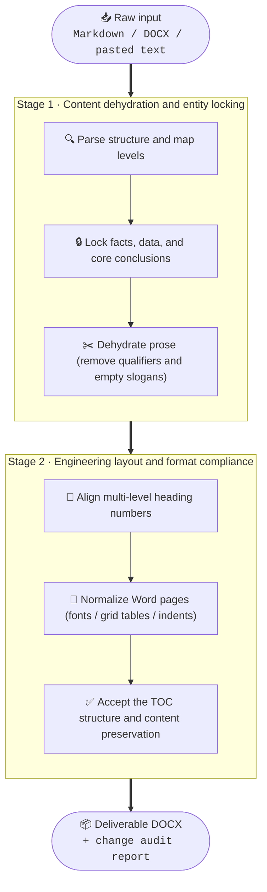

<div align="center">

🇬🇧 English · [🇨🇳 中文](README.md)


# Avoid Over AI Writing

### The AI Juicer: remove formulaic language and produce formal documents ready to deliver

<em>Turn formulaic drafts into well-formatted documents ready to hand over.</em>

<br />

[](LICENSE)
[](https://www.python.org/)
[](SKILL.md)
[](#community)

<br />

<kbd><a href="#quickstart">🚀 Quick start</a></kbd> ·
<kbd><a href="#effects">⚡ Core effect</a></kbd> ·
<kbd><a href="#compare">⚖️ Comparison</a></kbd> ·
<kbd><a href="#pipeline">🔄 Pipeline</a></kbd> ·
<kbd><a href="#roadmap">🗺️ Roadmap</a></kbd>

</div>

<a id="positioning"></a>

## 📌 Positioning

Stop spending the last half-hour of every workday cleaning up AI-generated drafts. This reusable Codex skill processes papers, technical proposals, patent disclosures, and formal Word documents. It organizes confirmed facts, figures, and conclusions into restrained prose, then turns Markdown, Word, or pasted text into a deliverable DOCX.

> [!IMPORTANT]
> **Facts are preserved.** The skill keeps user-confirmed facts, numbers, conclusions, and responsibility boundaries. It improves expression, structure, and formatting; it does not verify claims or perform technical review.

<a id="effects"></a>

## ⚡ Core effect

> [!CAUTION]
> ### Common AI patterns
> “In today’s rapidly evolving landscape,” “comprehensively empower,” “undoubtedly,” “moreover,” and “build a new paradigm” make formal documents longer without adding evidence or actionable information.

> [!TIP]
> ### Dehydration prescription
> Separate claims, evidence, methods, and results; reduce stacked uncertainty; remove unbounded promotional language; and standardize headings, tables, pagination, and the table of contents. More complete input produces a more stable deliverable.

<table>
<tr>
<td width="50%" valign="top">

**🔴 Raw AI draft · inflated**

> In the rapidly evolving distributed architecture, this module is undoubtedly a key enabler of system performance and can completely solve high-concurrency bottlenecks.

</td>
<td width="50%" valign="top">

**🟢 Dehydrated deliverable · precise**

> The system uses a Redis cluster for caching in high-concurrency scenarios. Benchmark results show read/write throughput of <u>50,000 QPS</u>, with response latency remaining within <u>3 ms</u>.

</td>
</tr>
</table>

<sub>The technology stack and metrics in this example are illustrative input data and are not performance claims about this project.</sub>

<a id="compare"></a>

## ⚖️ Comparison

| Dimension | Before | After |
| --- | --- | --- |
| Tone | Hedging, qualifiers, and grand narratives | Clear subjects, actions, conditions, and results |
| Content | Clichés hide the key information | Facts, figures, conclusions, and responsibility boundaries remain |
| Structure | Inconsistent heading numbers and paragraph levels | Unified headings, tables, pagination, and table of contents |
| Delivery | Repeated manual Word cleanup | A clear, consistently formatted DOCX |

<a id="pipeline"></a>

## 🔄 Processing pipeline



<a id="quickstart"></a>

## 🚀 Quick start

Clone the repository into your Codex skills directory, call `$avoid-over-ai-writing`, and state the document type, audience, confirmed conclusions, and desired format.

```powershell
git clone https://github.com/Wattson-Law/avoid-over-ai-writing-skill.git
Copy-Item -Recurse avoid-over-ai-writing-skill "$env:USERPROFILE\.codex\skills\avoid-over-ai-writing"
```

You can also use the conversion scripts directly:

```powershell
$env:PYTHONUTF8 = '1'
python scripts/markdown_to_docx.py input.md `
  --mode decision-proposal `
  --out draft.docx `
  --report convert.json

python scripts/ensure_toc.py draft.docx --out draft-with-toc.docx
.\scripts\update_word_fields.ps1 -InputDocx draft-with-toc.docx
```

<details>
<summary>🔧 Advanced processing and acceptance options</summary>

### Processing modes

Supports `requirements-list`, `decision-proposal`, `rd-application`, and `rd-implementation-outline`. The default `editorial` mode performs conservative rewriting while preserving source facts and semantic units.

### Content and format acceptance

```powershell
python scripts/audit_content_preservation.py source.docx output.docx `
  --report content-audit.json
python scripts/validate_standardized_docx.py output.docx `
  --mode decision-proposal `
  --source source.docx `
  --processing-strength editorial `
  --report format-validation.json
```

### Heading numbering

Use one numbering system throughout. Avoid mixing forms such as `Chapter 6`, `6.`, and `6 Chapter` in the same document.

</details>

<a id="scope"></a>

## 🎯 Scope

- Academic papers, proposals, and literature reviews
- Technical implementation plans, architecture documents, and bid responses
- Invention patent disclosures
- Formal Word reports requiring consistent formatting

Before processing, lock the facts, figures, conclusions, and audience requirements that must remain unchanged.

<a id="evidence"></a>

## 🔬 Research and evidence

Writing guidance references GB/T 7713.2-2022, GB/T 7714-2015, APA, MLA, and Chicago conventions. Evaluation uses public samples with authors, evidence, or human summaries. Each document type uses three source cases, two fresh runs per case, and cross-checking by two blind reviewers. See [style-evidence.md](references/style-evidence.md) and [evaluation.md](references/evaluation.md).

<a id="roadmap"></a>

## 🗺️ Roadmap

- [x] Conservative rewriting rules for formulaic AI prose
- [x] Multi-level heading normalization and TOC generation
- [x] DOCX table, font, pagination, and monochrome layout checks
- [ ] GB/T 7714 reference auditing
- [ ] Dedicated patent-disclosure and claims register
- [ ] Offline batch-conversion CLI

<a id="community"></a>

## 🌱 Community

Issues and pull requests are welcome. When adding a rule, include the original sentence, intended rewrite, and facts that must not change.

## 📂 Project structure

- `SKILL.md`: routing, evidence boundaries, style adaptation, and Word workflow
- `SKILL.en.md`: English rules and workflow overview
- `references/`: document structures, content boundaries, model adapters, and acceptance rules
- `scripts/`: Markdown-to-DOCX conversion, TOC generation, audits, and rendering
- `vendor/`: minimal self-contained runtime dependencies
- `examples/`: minimal input examples

## License

MIT License. See [LICENSE](LICENSE).
