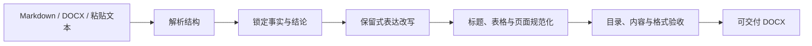

<div align="center">


# 避免过度 AI 写作

**去除模板化 AI 文风，交付规范排版的正式文稿**<br/>
*Strip away template AI mannerisms; deliver formatted, production-ready documents.*

[](LICENSE)
[](SKILL.md)
[](https://www.python.org/)

</div>

## 项目定位

这是一个可复用的 Codex skill，用于处理论文、技术方案、专利披露和正式 Word 文稿。它把已经确定的事实、数字和结论组织成更克制的表达，并将 Markdown、Word 或粘贴文本整理为可交付的 DOCX。

它解决的是正式文稿的最后一公里：模型输出常带有模板化套话、叠加不确定性和宣传化修辞，Word 文档又容易出现标题编号、字体、表格、分页和目录问题。

> 本项目不核验事实，不替代同行评审、专利检索或技术验收。它保留用户已经提供的事实与判断，只处理表达、结构呈现和格式。

## 适用文种

- 学术论文、开题报告和文献综述初稿
- 技术实施方案、架构设计书和投标技术说明
- 发明专利技术披露书
- 需要统一格式的正式 Word 汇报材料

## 核心能力

- 保留数字、单位、结论、责任主体和业务边界，降低模板化 AI 文风
- 按论文、方案、专利等文种组织信息，减少叠甲和无边界宣传语
- 统一标题层级和编号，例如将 `第六章 建设路线` 规范为 `六、建设路线`
- 统一中文与英文字体、段落、首行缩进、分页和页眉页脚
- 将 Markdown 表格转换为白底黑字、可编辑的 Word 表格，并自动添加表题
- 为决策方案生成三级自动目录，更新字段和页码
- 提供内容守恒审计、结构检查、格式验收和逐页渲染脚本

## 研究与证据来源

文风规则不是由某一次模型输出决定的。仓库把规则来源和评测过程分开记录：

1. **写作规范**：参考 GB/T 7713.2-2022、GB/T 7714-2015，以及 APA、MLA、Chicago 等公开写作与引文规范，用于约束论文结构、引文呈现、清晰度和可读性。
2. **真实文本样本**：优先使用带作者、证据或人工摘要的公开语料，例如 `allenai/qasper`、`NortheasternUniversity/big_patent` 和 `princeton-nlp/SWE-bench_Verified`。这些材料只用于提取结构和评估维度，不直接复制答案。
3. **多模型交叉检查**：对 Codex、Gemini、Claude 使用相同提示词和多轮样本，保留完整响应，由盲评者交叉检查。只有在多个样本中稳定出现、且两名评审一致确认的问题，才会形成模型适配规则。

当前评测记录、样本要求和稳定性门槛见 [evaluation.md](references/evaluation.md) 与 [provider-adapters.md](references/provider-adapters.md)。这套方法说明了规则从哪里来，也限定了它能支持到什么程度：它提高表达和交付的一致性，不把模型偏好包装成永久人格，也不替作者核验事实。

### 当前评测规模

每种文种使用 3 个来源案例，每个案例进行 2 次新运行，并由两名盲评者交叉检查。现有记录中，Gemini 的学术论文样本在 6/6 次运行出现同类无支持扩展，Claude 的论文、方案和专利样本均在 6/6 次运行出现直接交付失败；Codex 尚未达到需要单独适配器的稳定阈值。这些数字只描述记录中的模型版本和产品入口，不代表所有版本的永久特征。

## 工作流程



## Before / After

**Before**

> 在当今飞速发展的体系中，该模块毫无疑问是全面赋能系统效能的关键抓手。

**After**

> 系统在高并发场景下采用 Redis 集群提供缓存服务。基准测试结果显示，读写吞吐量为 50,000 QPS，响应延迟稳定在 3ms 以内。

改写保留技术栈和指标，只收紧套话、主观修辞和不明确的因果表达。

## 快速开始

将仓库安装到 Codex 的 skill 目录后，在对话中调用 `$avoid-over-ai-writing`，并说明文种、读者、已确定的结论和期望格式。

```powershell
git clone https://github.com/Wattson-Law/avoid-over-ai-writing-skill.git
Copy-Item -Recurse avoid-over-ai-writing-skill "$env:USERPROFILE\.codex\skills\avoid-over-ai-writing"
```

也可以直接使用仓库中的转换脚本：

```powershell
$env:PYTHONUTF8 = '1'
python scripts/markdown_to_docx.py input.md `
  --mode decision-proposal `
  --out draft.docx `
  --report convert.json

python scripts/ensure_toc.py draft.docx --out draft-with-toc.docx
.\scripts\update_word_fields.ps1 -InputDocx draft-with-toc.docx
```

可选的验收命令：

```powershell
python scripts/audit_content_preservation.py source.docx output.docx `
  --report content-audit.json
python scripts/validate_standardized_docx.py output.docx `
  --mode decision-proposal `
  --source source.docx `
  --processing-strength editorial `
  --report format-validation.json
```

## 适合谁

适合已经掌握核心事实、实验数据或技术结论，但需要把 AI 草稿整理成正式文稿的研究人员、工程师、专利撰写者和技术管理人员。

不适合用来凭空生成实验数据、补齐专利事实、规避学术审查或保证内容正确。事实核验和专业评审仍由作者负责。

## 项目结构

- `SKILL.md`：路由、证据边界、文风适配和 Word 工作流
- `references/`：文种结构、内容边界、模型适配和验收规则
- `scripts/`：Markdown 转 DOCX、目录、内容审计、格式验收和渲染
- `vendor/`：脚本运行所需的精简依赖
- `examples/`：最小输入示例

## Roadmap

- [x] AI 模板化表达的保留式改写规则
- [x] 多级标题规范化与目录生成
- [x] DOCX 表格、字体、分页和黑白版式验收
- [ ] GB/T 7714 参考文献格式审计
- [ ] 专利交底书和权利要求书的专用语态适配
- [ ] 无需进入对话界面的离线批量转换 CLI

## 参与贡献

欢迎提交 Issue 和 Pull Request。新增规则时请同时提供原句、改写目标和不会改变的事实边界，并运行现有校验脚本。

## License

MIT License，详见 [LICENSE](LICENSE)。
