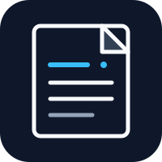
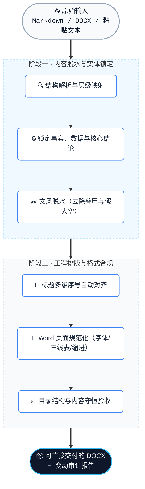

<div align="center">

🇨🇳 中文 · [🇬🇧 English](README.en.md)



# 避免过度 AI 写作

### AI 榨汁机，去除模板化，生成可直接交付、**规范排版的正式文稿**

<em>The AI Juicer: turn formulaic drafts into well-formatted documents ready to hand over.</em>

<br />

[](LICENSE)
[](https://www.python.org/)
[](SKILL.md)
[](#community)
[](https://github.com/Wattson-Law/avoid-over-ai-writing-skill/stargazers)
[](https://github.com/Wattson-Law/avoid-over-ai-writing-skill/network/members)
[](#)

<br />

<kbd><a href="#quickstart">🚀 快速上手</a></kbd> ·
<kbd><a href="#effects">⚡ 核心效果</a></kbd> ·
<kbd><a href="#compare">⚖️ 对比视界</a></kbd> ·
<kbd><a href="#pipeline">🔄 处理流水线</a></kbd> ·
<kbd><a href="#roadmap">🗺️ 路线图</a></kbd>

</div>

<a id="positioning"></a>

## 📌 项目定位

还在每天下班前花半小时给 AI 生成的烂摊子擦屁股？别再当它的“人工后处理流水线工人”了。挂上这个 Skill，给 AI 套上紧箍咒，按头交出能直接甩给老板的正式 Word。

这是一个可复用的 Codex skill，用于处理论文、技术方案、专利披露和正式 Word 文稿。它把已经确定的事实、数字和结论组织成更克制的表达，并将 Markdown、Word 或粘贴文本整理为可交付的 DOCX。

> [!IMPORTANT]
> **事实绝对守恒。** Skill 保留用户已经确认的事实、数字、结论和责任边界，专注于表达、结构呈现和格式交付。

<a id="effects"></a>

## ⚡ 核心效果

> [!CAUTION]
> ### AI 味重灾区
> “随着……飞速发展”“全面赋能”“毫无疑问”“不仅如此”“构建新范式”——这些词让正式文稿变长，却没有增加证据和可执行信息。

> [!TIP]
> ### 脱水处方
> 把主张、依据、方法和结果分开写；收紧叠加的不确定性；去掉无边界的宣传修辞；统一标题、表格、分页和目录。输入信息越完整，交付稿越稳定。

<table>
<tr>
<td width="50%" valign="top">

**🔴 原始 AI 草稿 · 油腻含水**

> 在当今飞速发展的分布式体系中，该模块毫无疑问是全面赋能系统效能的关键抓手，能够彻底解决高并发瓶颈。

</td>
<td width="50%" valign="top">

**🟢 脱水交付稿 · 严肃合规**

> 系统在高并发场景下采用 Redis 集群提供缓存服务。基准测试结果显示，读写吞吐量为 <u>50,000 QPS</u>，响应延迟稳定在 <u>3ms</u> 以内。

</td>
</tr>
</table>

<sub>示例中的技术栈和指标属于输入样例，用于展示表达改写方式，不代表本项目自身的性能测试。</sub>

<a id="compare"></a>

## ⚖️ 对比视界

| 维度 | 处理前 | 处理后 |
| --- | --- | --- |
| 语气 | 叠甲、摇摆、宏大叙事 | 对象、动作、条件和结果清楚 |
| 内容 | 套话掩盖核心信息 | 保留事实、数字、结论和责任边界 |
| 结构 | 标题编号混乱，段落层级不稳定 | 统一标题层级、表格、分页和目录 |
| 交付 | 需要人工反复整理 Word | 输出结构清晰、格式统一的 DOCX |

<a id="pipeline"></a>

## 🔄 处理流水线



<a id="quickstart"></a>

## 🚀 快速上手

将仓库安装到 Codex 的 skill 目录，在对话中调用 `$avoid-over-ai-writing`，并说明文种、读者、已确定的结论和期望格式。

```powershell
git clone https://github.com/Wattson-Law/avoid-over-ai-writing-skill.git
Copy-Item -Recurse avoid-over-ai-writing-skill "$env:USERPROFILE\.codex\skills\avoid-over-ai-writing"
```

也可以直接使用转换脚本：

```powershell
$env:PYTHONUTF8 = '1'
python scripts/markdown_to_docx.py input.md `
  --mode decision-proposal `
  --out draft.docx `
  --report convert.json

python scripts/ensure_toc.py draft.docx --out draft-with-toc.docx
.\scripts\update_word_fields.ps1 -InputDocx draft-with-toc.docx
```

<details>
<summary>🔧 展开：高级验收与处理选项</summary>

### 处理模式

支持 `requirements-list`、`decision-proposal`、`rd-application` 和 `rd-implementation-outline` 四种文档模式。默认采用 `editorial` 保留式改写，保留源文档的事实和语义单元。

### 内容与格式验收

```powershell
python scripts/audit_content_preservation.py source.docx output.docx `
  --report content-audit.json
python scripts/validate_standardized_docx.py output.docx `
  --mode decision-proposal `
  --source source.docx `
  --processing-strength editorial `
  --report format-validation.json
```

### 标题编号规范

标题默认采用单一编号体系，例如把 `第六章 建设路线` 转为 `六、建设路线`，避免 `第六、` 和 `六章、` 等混合形式。

</details>

<a id="scope"></a>

## 🎯 适用范围

- 学术论文、开题报告和文献综述初稿
- 技术实施方案、架构设计书和投标技术说明
- 发明专利技术披露书
- 需要统一格式的正式 Word 汇报材料

使用前先锁定事实、数据、结论和读者要求，便于 skill 将内容稳定转换为正式文稿。

<a id="evidence"></a>

## 🔬 研究与证据来源

文风规则参考 GB/T 7713.2-2022、GB/T 7714-2015，以及 APA、MLA、Chicago 等写作与引文规范；评测使用带作者、证据或人工摘要的公开语料，并由 Gemini 参与统一提示词和多轮样本评测，提炼叠甲、泛化和宣传化表达的矫正提示词。

每种文种使用 3 个来源案例，每个案例进行 2 次新运行，并由两名盲评者交叉检查。完整来源说明见 [style-evidence.md](references/style-evidence.md)，评测协议见 [evaluation.md](references/evaluation.md)。

<a id="roadmap"></a>

## 🗺️ 路线图

- [x] AI 模板化表达的保留式改写规则
- [x] 多级标题规范化与目录生成
- [x] DOCX 表格、字体、分页和黑白版式验收
- [ ] GB/T 7714 参考文献格式审计
- [ ] 专利交底书和权利要求书的专用语态适配
- [ ] 无需进入对话界面的离线批量转换 CLI

<a id="community"></a>

## 🌱 社区与互动

欢迎提交 [Issue](https://github.com/Wattson-Law/avoid-over-ai-writing-skill/issues) 和 Pull Request。新增规则时请同时提供原句、改写目标和不会改变的事实边界。

[](https://star-history.com/#Wattson-Law/avoid-over-ai-writing-skill&Date)

如果这个 Skill 帮你省下了反复整理 Word 的时间，欢迎点一个 Star，或在 Issue 中分享你的使用场景。

## 📂 项目结构

- `SKILL.md`：路由、证据边界、文风适配和 Word 工作流
- `SKILL.en.md`：English rules and workflow overview
- `references/`：文种结构、内容边界、模型适配和验收规则
- `scripts/`：Markdown 转 DOCX、目录、内容审计、格式验收和渲染
- `vendor/`：脚本运行所需的精简依赖
- `examples/`：最小输入示例

## License

MIT License，详见 [LICENSE](LICENSE)。


