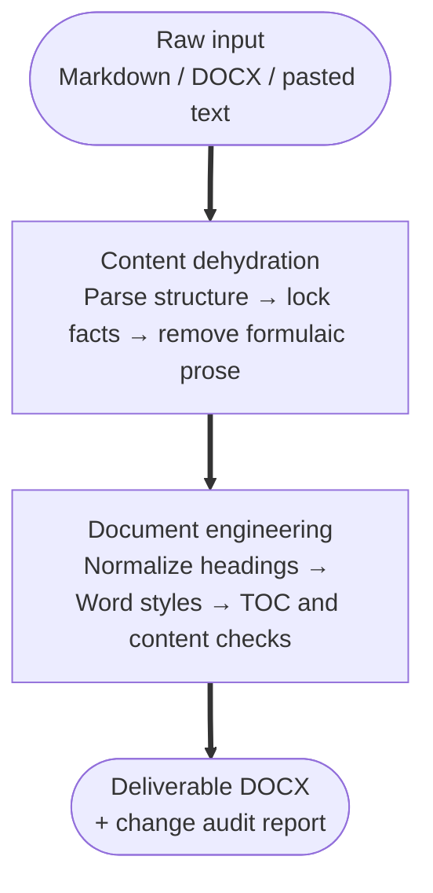

<div align="center">

🇬🇧 English · [🇨🇳 中文](README.zh-CN.md)


# Avoid Over AI Writing

### The AI Juicer: remove formulaic language and produce formal documents ready to deliver

[](LICENSE)
[](https://www.python.org/)
[](SKILL.md)
[](#community)

</div>

## What it does

This reusable Codex skill processes papers, technical proposals, patent disclosures, and formal Word documents. It turns confirmed facts, figures, and conclusions into restrained, reader-focused prose, then converts Markdown, Word, or pasted text into a clean, deliverable DOCX.

> [!IMPORTANT]
> **Facts are preserved.** The skill keeps user-confirmed facts, numbers, conclusions, and responsibility boundaries. It improves expression, structure, and formatting; it does not verify claims or perform technical review.

## Core effect

AI-generated drafts often become longer without adding evidence: “in today’s rapidly evolving landscape,” “comprehensively empower,” and “build a new paradigm.” The skill separates claims, evidence, methods, and results; removes unsupported promotional language; and standardizes headings, tables, pagination, and tables of contents.

**Before**

> In the rapidly evolving distributed architecture, this module is undoubtedly a key enabler of system performance and can completely solve high-concurrency bottlenecks.

**After**

> The system uses a Redis cluster for caching in high-concurrency scenarios. Benchmark results show read/write throughput of **50,000 QPS**, with response latency remaining within **3 ms**.

The figures in this example are illustrative input data and are not performance claims about this project.

## Processing pipeline



## Quick start

Clone the repository into your Codex skills directory and call `$avoid-over-ai-writing` in a conversation. State the document type, audience, confirmed conclusions, and desired output format.

```powershell
git clone https://github.com/Wattson-Law/avoid-over-ai-writing-skill.git
Copy-Item -Recurse avoid-over-ai-writing-skill "$env:USERPROFILE\.codex\skills\avoid-over-ai-writing"
```

The conversion scripts can also be used directly:

```powershell
$env:PYTHONUTF8 = '1'
python scripts/markdown_to_docx.py input.md `
  --mode decision-proposal `
  --out draft.docx `
  --report convert.json

python scripts/ensure_toc.py draft.docx --out draft-with-toc.docx
.\scripts\update_word_fields.ps1 -InputDocx draft-with-toc.docx
```

Supported modes are `requirements-list`, `decision-proposal`, `rd-application`, and `rd-implementation-outline`. The default `editorial` strength makes local, conservative wording improvements while preserving every business fact.

## Scope

- Academic papers, proposals, and literature reviews
- Technical implementation plans, architecture documents, and bid responses
- Invention patent disclosures
- Formal Word reports that need consistent structure and formatting

Before processing, provide the facts, figures, conclusions, and audience requirements that must remain unchanged.

## Evidence and evaluation

Writing guidance draws on GB/T 7713.2-2022, GB/T 7714-2015, APA, MLA, and Chicago conventions. Evaluation uses public samples with authors, evidence, or human summaries. Each document type uses three source cases, two fresh runs per case, and cross-checking by two blind reviewers. See [style-evidence.md](references/style-evidence.md) and [evaluation.md](references/evaluation.md).

## Roadmap

- [x] Conservative rewriting rules for formulaic AI prose
- [x] Heading normalization and table-of-contents generation
- [x] DOCX table, font, pagination, and monochrome layout checks
- [ ] GB/T 7714 reference auditing
- [ ] Dedicated patent-disclosure and claims register
- [ ] Offline batch-conversion CLI

## Community

Issues and pull requests are welcome. When adding a rule, include the original sentence, the intended rewrite, and the facts that must not change.

## Project structure

- `SKILL.md`: routing, evidence boundaries, style adaptation, and Word workflow
- `references/`: document structures, content boundaries, model adapters, and acceptance rules
- `scripts/`: Markdown-to-DOCX conversion, TOC generation, audits, and rendering
- `vendor/`: minimal self-contained runtime dependencies
- `examples/`: minimal input examples

## License

MIT License. See [LICENSE](LICENSE).
